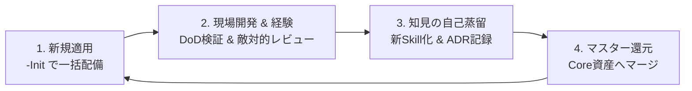

# 🚀 Core AI Agents Template

[](LICENSE)
[](#-クイックスタート-1-コマンドで配備)
[](.agents/AGENTS.md)

**完全自立型 汎用 AI エージェント開発基盤 ＆ スキルテンプレート**

あらゆるソフトウェア開発プロジェクトへ **1 コマンドで即座に配備可能** な、世界最先端の AI 協働開発規約（`AGENTS.md`）、再利用可能な 10 種の Core スキル、および 4 段階完了定義ゲート（DoD 自動検証）の統合パッケージです。

---

## 🌟 主な特徴 (Key Features)

- **進化型 Dual-AI 黄金サイクル:**
  - **Primary Agent**（計画・実装・敵対的自己レビュー）と **Review Agent**（破壊的変更時の重大関門検証）の多層チェック構造。
- **4大ペルソナによる敵対的自己レビュー:**
  - `SRE（耐障害性）`、`DevUX（属人化排除）`、`PMO（過剰設計防止）`、`データ整合性（監査性）` の視点で計画の欠陥を冷徹に事前摘出。
- **4段階完了定義ゲート (Definition of Done - DoD):**
  - 静的型検査（G1）、ユニットテスト（G2）、ビルド（G3）、セキュリティ（G4）のすべてで **実測終了コード 0 (exit 0)** を機械判定。
- **自立型 10 種の Core スキル:**
  - ADR自動記録、高精度仕様化、大規模リファクタリング、水平展開監査、リリースレビュー等を標準装備。
- **クロスプラットフォーム ＆ ゼロ依存:**
  - Python 標準ライブラリのみで実装され、追加パッケージ不要で Windows / macOS / Linux に対応。

---

## 🚀 クイックスタート (1 コマンドで配備)

新規プロジェクトまたは既存プロジェクトのルートディレクトリに対して、以下のコマンドを実行するだけで AI 開発基盤が一括配備されます。

```bash
# Python 経由（全 OS 共通）
python3 scripts/sync_agent_template.py -Init -TargetPath "/path/to/my-project"

# Windows PowerShell ラッパー
.\scripts\sync_agent_template.ps1 -Init -TargetPath "C:\path\to\my-project"

# macOS / Linux Bash ラッパー
bash scripts/sync_agent_template.sh -Init -TargetPath "/path/to/my-project"
```

---

## 📂 ディレクトリ構成 (Repository Structure)

```text
.
├── .agents/                        # AI エージェント開発基盤
│   ├── AGENTS.md                   # AI 行動規範・協働プロトコル・DoD 規約
│   ├── agent_config.json           # モデルロール定義 & DoD コマンド設定
│   ├── DOMAIN.md.example           # プロジェクト固有規約のテンプレート
│   ├── README.md                   # スキルカタログ & インデックス
│   └── skills/                     # 汎用 Core スキル群 (10種)
│       ├── architecture-decision-records/      # ADR 設計決定記録
│       ├── design-and-plan/                    # 設計 & 開発計画策定
│       ├── implementation-and-refactor/        # 実装 & DRY & ロギング規約
│       ├── large-scale-code-refactoring/       # 後方互換性担保の大規模分割
│       ├── performance-tuning-and-caching/     # クエリ & TTLキャッシュ戦略
│       ├── release-review/                     # リリース前 5 大チェック
│       ├── requirements-to-spec/               # 要求〜高精度機能仕様書変換
│       ├── self-audit-and-regression-prevention/# 水平展開 & 冪等性自己監査
│       ├── template-generalization-and-audit/  # 汎用性 & 自立性監査
│       └── testing-and-verification/           # 自動テスト & ビルド検証
├── docs/                           # ドキュメント資産
│   ├── adr/                        # Architecture Decision Records
│   │   └── 0000_template.md        # ADR 標準テンプレート
│   └── guides/
│       └── AGENT_TEMPLATE_LIFECYCLE.md # 運用 & マスター還元ガイド
├── scripts/                        # 同期 & スモークテストツール
│   ├── sync_agent_template.py      # 配備 & 診断 Python 本体
│   ├── sync_agent_template.ps1     # PowerShell ラッパー
│   └── sync_agent_template.sh      # Bash ラッパー
├── .gitignore                      # Git 除外設定
├── LICENSE                         # MIT License
└── README.md                       # 本ドキュメント
```

---

## 🔄 開発ライフサイクル ＆ マスター還元

現場プロジェクトでの知見や新スキルを蓄積し、マスターテンプレートを進化させるサイクルを標準サポートしています。



詳細な運用手順は [AGENT_TEMPLATE_LIFECYCLE.md](docs/guides/AGENT_TEMPLATE_LIFECYCLE.md) を参照してください。

---

## 🧪 テンプレート自己健全性検証 (Smoke Test)

テンプレート自体の整合性とサンドボックス配備テストを実行できます：

```bash
python3 scripts/sync_agent_template.py -Test
```

---

## 📄 ライセンス

本リポジトリは [MIT License](LICENSE) の下で公開されています。
