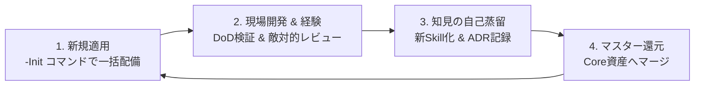

# AI Agent テンプレート・ライフサイクル運用ガイド (AGENT_TEMPLATE_LIFECYCLE.md)

本ドキュメントは、汎用 AI Agent 開発基盤（`AGENTS.md`、Core スキル 9 種、DoD 4段自動検証、`agent_config.json`）を新規プロジェクトへ展開し、現場での経験を自律的にマスターへ還元・進化させるための標準運用プロトコルを定めます。

---

## 🔄 テンプレート・ライフサイクルの 4 ステップ



---

## 1. 新規プロジェクトへの適用（初期化ステップ）

新規プロジェクトを立ち上げる際、わずか 1 コマンドで世界最先端の AI 協働開発基盤を配備できます。

```bash
# Python 経由（全 OS 共通）
python3 scripts/sync_agent_template.py -Init -TargetPath "/path/to/my-new-app"

# Windows PowerShell ラッパー
.\scripts\sync_agent_template.ps1 -Init -TargetPath "C:\path\to\my-new-app"

# macOS / Linux Bash ラッパー
bash scripts/sync_agent_template.sh -Init -TargetPath "/path/to/my-new-app"
```

### 配備される資産
- `.agents/AGENTS.md`: 最高品質 6 原則、DoD 4段自動検証、3段階敵対的レビュープロトコル
- `.agents/agent_config.json`: モデル定義、DoD コマンド、プロジェクト設定
- `.agents/DOMAIN.md.example`: プロジェクト固有規約のテンプレート
- `.agents/README.md`: スキルインデックス
- `.agents/skills/`: 汎用 Core スキル 9 種（ADR、要件定義、リファクタリング、自己監査、リリースレビュー、テスト、キャッシュ等）
- `scripts/sync_agent_template.*`: 今後の同期・還元スクリプト
- `docs/guides/AGENT_TEMPLATE_LIFECYCLE.md`: 本ガイド

---

## 2. 現場開発中の運用プロトコル

新規プロジェクトでの日々の開発においては、配備された `AGENTS.md` の以下のサイクルを回します。

1. **多角的敵対的自己レビュー:**
   - 実装前に「SRE」「DevUX」「PMO」「データ整合性」のペルソナによる `plan_review.md` を自動生成し、手戻りを未然に防ぐ。
2. **DoD 4段階自動検証:**
   - `agent_config.json` に設定されたコマンド（型検査・自動テスト・ビルド・セキュリティ）のすべてで `exit 0` を確認する。

---

## 3. 知見の自己蒸留プロトコル (Self-Evolving Skills)

開発や本番運用中に以下の事象が発生した場合、AI は自律的に知見を蒸留します。

1. **未知のエラーや環境依存のトラブルを解決した場合:**
   - AI は解決パターンを抽出し、`.agents/skills/<new-skill-name>/SKILL.md` の新設をユーザーに提案する。
2. **重要なアーキテクチャ・設計決定を行った場合:**
   - `architecture-decision-records` スキルに基づき、`docs/adr/XXXX_[short-title].md` に設計意図・代替案・トレードオフを記録する。

---

## 4. マスターテンプレートへの還元ステップ (Upstream Sync)

現場プロジェクトで磨かれた新しい Skill や規約の改善をマスターテンプレートへ還元する手順です。

1. **スキルの分類判定:**
   - 新設・改修したスキルの YAML Frontmatter に `category: "core"`（汎用）または `category: "domain"`（特化）を付与。
2. **Core 資産の同期:**
   - 汎用的な知見を含むファイルをマスター側の `.agents/skills/` へ反映。
3. **バージョンアップコミット:**
   - `feat: update core agent template with new <skill-name>` の Conventional Commit を発行。

---

## 5. テンプレート整合性スモークテスト

テンプレート自体の健全性を検証するには、以下を実行します：
```bash
python3 scripts/sync_agent_template.py -Test
```
